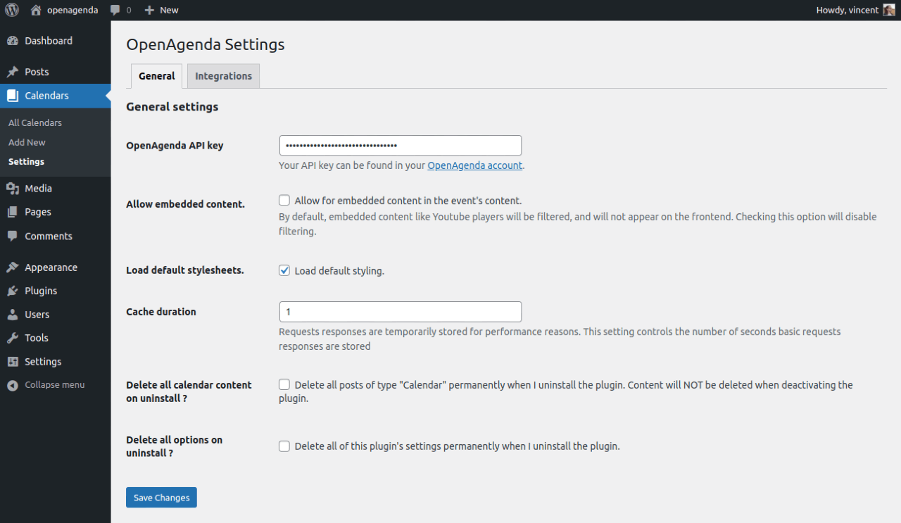
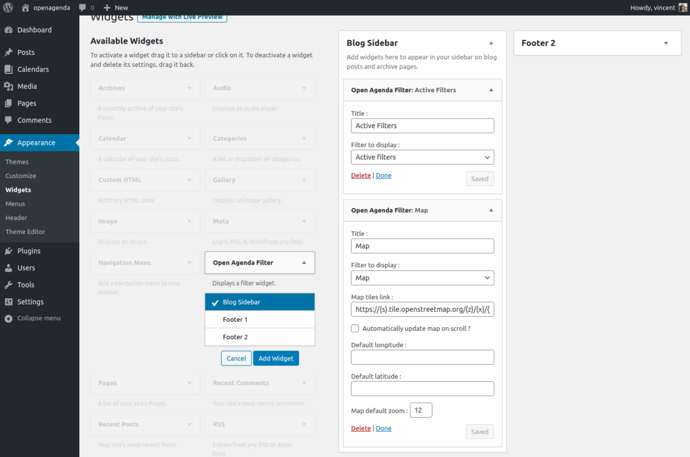

# Openagenda WordPress Plugin

This WordPress plugin allows you to embed any calendar hosted on [https://openagenda.com](https://openagenda.com) on your WordPress site.

## Installation

This plugin is hosted on the official WordPress repository at the following URL : 

[https://wordpress.org/plugins/openagenda/](https://wordpress.org/plugins/openagenda/)

If you install this plugin from the official WordPress repository, the name of the folder in your `wp-content/plugins/` directory will be `openagenda/`.

If you wish to install this plugin on your local machine from this GitHub repository for development purposes, **please make sure its folder name IS NOT `openagenda/` as any update published on the official WordPress repository will overwrite your work.**

## Basic usage

Upon activation, the plugin creates a new post type named *Calendars*. Just create a new calendar, provide the UID of the calendar you wish to display in the  settings box, and that's it !


You can leave the content area for this calendar empty, as it will be populated automatically with your events.


Your events are automatically inserted after your content. If you wish to control where your events will be listed, just use the shortcode `[openagenda]` in your content.

## Settings

General settings can be found under the *Calendar > Settings* entry in the admin menu.

All data related to your API key or calendars can be found on [https://openagenda.com](https://openagenda.com).



The settings are divided into two tabs: General and Integrations.

### General settings

The General settings tab provides the following settings : 

 * *Open Agenda API key* : Your user API key. **Providing your account API key is required for the plugin to work properly.** It can be found in your account on [https://openagenda.com](https://openagenda.com)
 * *Allow for embedded content* : If your events contain embedded content, tick this box to allow the corresponding HTML tags.
 * *Load default stylesheets* : The plugin provides very basic styling and depends heavily on your theme's styles. Disable this to rely 100% on your theme styles.
 * *Cache duration* : For performance reasons, basic requests to Openagenda are temporarily kept in cache. This settings controls the time to keep them cached, in seconds.
 * *Delete all calendar content on uninstall ?* : controls whether you want to delete all your content on uninstall.
 * *Delete all options on uninstall ?* : controls whether you want to delete all your calendar settings on uninstall.

### Integrations settings

The *Integrations* tab allows you to fine tune settings for various third party services the plugin uses.

**OpenStreetmap integration settings :**

 * *Default map tiles link* : This is the map tile used for the various maps displayed by the plugin.
 * *Default map tiles attribution link* : this is the default attribution link placed on OpenStreetMaps.

**CloudImage integration settings :**

 * *CloudImage API key* : If you wish to use CloudImage to serve your images, enter your API key here.

### Permalinks settings

In the *Permalinks* settings, you can change the prefix for your calendar pages. You cannot leave this blank as your URLs will conflict with WordPress' default pages and posts.

### Customizer settings

In the *Customizer*, a new panel is available to house various display settings. For now only a main color setting is available.


## How to get my calendar UID ?

The UID of the calendar you wish to display can be found directly on your calendar page on [Openagenda](https://openagenda.com). Go to the site, and click *Look for an agenda*. Then use search box to find your calendar.


Once you have it displayed, scroll down a little, and you will find your UID just under the last widget, in the sidebar on the right.

## Filter widget and shortcodes

To allow users to easily find relevant events, the plugin also provides a convenient filter widget. Place the widget in your sidebar or other widgetized area, pick a filter and tweak any additionnal settings in the widgets admin.



To integrate filters directly in your content instead of widget areas, the plugin also provide shortcodes.

Every shortcode listed here (except for `[openagenda]`) corresponds to a filter option in the widget.

Additionaly, shortcodes and widget filters have the same parameters, and every shortcode attribute corresponds to a widget filter setting.

**`[openagenda]`**

Displays the calendar. You do not need to use this shortcode explicitely, as it is automatically injected in the content of your "calendars" posts.

However, if you need to insert static content after your list of events, you can do so by inserting this shortcode, then your static content afterwards.

**`[openagenda_filter_active]`**

Displays the active filters. It takes no parameters.

**`[openagenda_filter_choice]`**

Displays a list of choices, depending on the field chosen. It takes the following parameters : 

 * `field`: the slug of the choice field you want to display (e.g. "cities", "keywords", "departments", etc... ).
 * `additional_field`: Any custom field you have setup in your OpenAgenda administration. Only works when 'Additional Field' is the chosen field.
 * `page_size`: Number of options to display before the 'More options' button.

You can find the list of available additional fields in the Forms section of your agenda settings on openagenda.com (ex: https://openagenda.com/[your-agenda]/admin/schema)

**`[openagenda_filter_calendar]`**

Displays a calendar. It takes no parameters.

**`[openagenda_filter_map]`**

Displays an interactive map to locate and search events. It takes the following parameters :

 * `map_tiles_link` : Lien tiles link to use. Defaults to `https://{s}.tile.openstreetmap.org/{z}/{x}/{y}.png`
 * `map_auto` : Whether to automatically update map on scroll. 

**`[openagenda_filter_relative]`**

Allows to filters past or upcoming events. It takes no parameters.

**`[openagenda_filter_search]`**

Displays a search field. It takes the following parameters :

 * `placeholder` : text field placeholder.

**`[openagenda_filter_preview]`**

Displays next events. It takes the following parameters : 

 * `uid` : UID of the calendar you wish to preview.
 * `size` : Number of events to display.
 * `filters` : Query string representing filters to apply to the request.
 
## Customization

Templates for the list of events and individual events can be customized in your theme.

Just create a folder named `openagenda/` in your theme, then copy and paste the template you wish to override located in the plugin's `templates/` folder.

The plugin provide convenient template tags for you to display event data in the `inc/template-tags.php` file. Feel free to define your own in your theme.

The plugin also provides many hooks to allow you to customize the html output or other various data. The hooks documentation is in writing for now !

## Usage of third party services and copyright information

This plugin displays data hosted and provided by [https://openagenda.com](https://openagenda.com). By using this plugin, you accept and agree with OpenAgenda's [terms and conditions](https://openagenda.zendesk.com/hc/fr/articles/201753991) and [privacy policy](https://openagenda.zendesk.com/hc/fr/articles/360003182014). Please make sure to read them before using this plugin. Also, using this plugin does NOT require an account at [https://openagenda.com](https://openagenda.com), though it is recommended to have one.

Maps displayed by this plugin use data from [https://openstreetmap.org/](https://openstreetmap.org/) and uses the [leaflet JS library](https://leafletjs.com/). By using this plugin, you accept and agree with OpenStreeMap's [terms of use](https://wiki.osmfoundation.org/wiki/Terms_of_Use), [acceptable use policy](https://wiki.openstreetmap.org/wiki/Acceptable_Use_Policy) and [privacy policy](https://wiki.osmfoundation.org/wiki/Privacy_Policy)

The plugin provides optional integration with CloudImage. The integration requires to create an account at [https://cloudimage.io](https://cloudimage.io) and accept and agree their [terms of use](https://assets.scaleflex.com/Sales/Legal/Scaleflex+Services+Terms+and+Conditions+%5BFR%5D.pdf).

Icons used in the UI are [Genericons](https://genericons.com/), licenced under the GPL 2.0.

## Developer documentation

### Template overrides

You can build customized templates for the event list view or single event view. Default templates are located in the `templates/` folder. You can copy and paste the file you want to override in a folder called `openagenda/` in your theme or child theme directory, and customize its content.

The plugin will look for templates first in the `openagenda/` folder of your child theme, then in the `openagenda/` folder of your parent theme, and finally in the plugins `templates/` folder.

### Function reference

The file `inc/template-tags.php` contains functions used in templates to display various event data. The file `inc/helper-functions.php` contains functions used elsewhere throughout the plugin to help with various tasks or data formatting. 

Here is a quick rundown of the main functions you will need when customizing the templates.

#### `openagenda_get_event( $event_uid = false )`

Returns the event corresponding to the passed in UID or the current event in the event loop if not provided. Note that the function doesn't query the main [openagenda.com](https://openagenda.com) site, but looks in the events already queried on page load. So it will return `false` if no events can be found with the provided UID within the page's events.

#### `openagenda_get_field( $field, $event_uid = false )`

This functions returns the value corresponding to the field passed in for the event corresponding to the given UID, or for the current event in the event loop if no UID was provided.

Basically the functions reads the raw JSON event, except for `permalink` and `timings` fields, for which a custom treatment is needed.

For multilingual fields, the value corresponding to the current locale is returned.

**If you need the raw value from the JSON event, this function is the one to use.**

Returned value are passed through the following filter : `apply_filters( 'openagenda_field', $value, $field, $event_uid );`

#### `openagenda_field( $field, $event_uid = false )`

Like `openagenda_get_field( $field, $uid = false )`, but escapes and echoes the field value.

#### `openagenda_esc_field( $value, $field )`

This function is used internally by `openagenda_field()` to escape the field value properly, depending on the field type.

#### `openagenda_event_permalink( $event_uid = false, $echo = true, $use_context = false )`

Returns or echoes an event permalink, corresponding to the UID passed in or the current event in the event loop. The `use_context` param is used on event list views to append a string representing the page and current list filters.

The returned value is passed through the following filter : `apply_filters( 'openagenda_event_permalink', $permalink, $event_uid, $use_context )`.

#### `openagenda_get_event_image( $size = '', $event_uid = '' )`

Returns the HTML used to display an event image. Default size is 700px wide. `thumbnail` size is 200px by 200px by default. `full` size corresponds to original uploaded image size.

If you use the CloudImage integration, this function also accepts an array of CloudImage arguments instead of a size string slug as its first parameter. For example, you can pass in `array( 'width'=> 500, 'height' => 500, 'grey' => 1 )` to display a 500px by 500px grayscale image, processed by CloudImage.

Using this requires you to signup for an account at [https://cloudimage.io](https://cloudimage.io), and fill in the corresponding API key setting in the *Integrations* settings of the plugin. Documentation for the accepted arguments can be found at [https://docs.cloudimage.io/go/cloudimage-documentation-v7/](https://docs.cloudimage.io/go/cloudimage-documentation-v7/)

The returned HTML is passed through the following filter : `apply_filters( 'openagenda_event_image', $html, $event_uid, $size )`.

#### `openagenda_event_image( $size = '', $event_uid = '' )`

Echoes an event image.

#### `openagenda_event_timing( $display = 'date', $event_uid = false, $echo = true )`

Displays the next or last timing for a given event, in the format corresponding to the `$display` parameter. If no `$event_uid` is provided, it defaults to the current event.

`$display` accepts `date` (default), or `relative`. If `relative` the next or last event timing is displayed in a human readable time difference from now (e.g. 'In two weeks', '2 hours ago'). Else, its date is displayed.

The HTML returned is passed through the following filter : `apply_filters( 'openagenda_event_timing', $html, $event_uid, $display )`.

#### `openagenda_event_timings( $event_uid = false, $echo = true )`

Displays a formatted list of all timings for an event.

The HTML returned is passed through the following filter : `apply_filters( 'openagenda_event_timings', $html, $event_uid, $months )`.

#### `openagenda_event_map( $event_uid = false, $echo = true )`

Displays or returns the HTML for the map corresponding to the location of the given event.

The HTML returned is passed through the following filter : `apply_filters( 'openagenda_event_map_html', $html, $event_uid )`.

#### `openagenda_favorite_badge( $event_uid = false, $echo = true )`

Displays or returns the button to add an event to favorites. Favorites can be filtered on the front end using the Openagenda filter widget.

The HTML returned is passed through the following filter : `apply_filters( 'openagenda_event_favorite_badge', $html, $event_uid, $agenda_uid, $icon_active, $icon_inactive, $text )`.

#### `openagenda_event_additional_field( $field, $event_uid = false, $echo = true )`

Displays or retrieves links corresponding to an additional field values, using labels corresponding to current locale. If no `$event_uid` is provided, it defaults to the current event.

The HTML returned is passed through the following filter : `apply_filters( 'openagenda_event_additional_field', $html, $field, $event_uid' )`.

#### `openagenda_event_share_buttons( $event_uid = false, $echo = true )`

Displays or returns the HTML for the event share buttons. By default, Twitter, Facebook and Linkedin share links are provided. To add your own, use the following filter : `apply_filters( 'openagenda_sharers', $sharers, $event_uid, $event )`.

The HTML returned is passed through the following filter : `apply_filters( 'openagenda_sharers_html', $html, $uid, $event )`.

#### `openagenda_pagination( $args = array() )`

Displays pagination on list view. Works basically like WordPress' `paginate_links()` function. Here are the defaults arguments :

```php
$args = array(
    'end_size'     => 2,    // Number of items to display after the first page or before the last page
    'mid_size'     => 2,    // Number of page to display around the current page
    'label_format' => '%s', // format used in sprintf() function to display labels. Can be used to wrap labels in additional HTML.
    'prev_label'   => __( 'Previous page', 'openagenda' ),   // Previous page label
    'next_label'   => __( 'Next page', 'openagenda' ),       // Next page label
);
```

The arguments can be filtered using the following filter : `apply_filters( 'openagenda_page_links_args', $args, $agenda_uid )`. 

The final HTML can be filtered using the following filter : `apply_filters( 'openagenda_page_links', $links, $agenda_uid )`.

#### `openagenda_get_permalink( $agenda_uid = false )`

Returns the permalink to the calendar corresponding to the UID given. Defaults to the current calendar on calendar pages.

The permalink can be filtrered using the following filter : `apply_filters( 'openagenda_permalink', $permalink, $agenda_uid )`.

#### `openagenda_exports( $agenda_uid = false, $echo = true )`

Displays exports links for the calendar corresponding to the given UID. Defaults to current calendar. 

The returned HTML passes throught the following filter : `apply_filters( 'openagenda_exports_html', $html, $agenda_uid )`.

#### `openagenda_filter( $filter, $args = array() )`

Displays a filter widget. Values for the `$filter` parameter include `active`, `choice`, `calendar`, `map`, `preview`, `relative`, `search`. The `$args` array contains shortcode settings. See [Filter widget and shortcodes](#filter-widget-and-shortcodes) for details.

Avoid using inside the main template on list views. As the list of events may be refreshed with Ajax, the script handling the filter may loose connection to it as the DOM element will be removed and refreshed.

#### `openagenda_navigation( $echo = true )`

Displays or returns HTML corresponding to the event navigation on single event pages.

The HTML returned goes through the following filter : `apply_filters( 'openagenda_event_navigation', $html, $previous_link, $next_link )`.

#### `openagenda_get_adjacent_event_link( $direction = 'next', $event_uid = false )`

Used by `openagenda_navigation()`.

Returns link **used to fetch** the adjacent event link. Since content is fetched from a JSON export of the agenda, on single event pages, only one event is fetched. Since events are not stored in the database, a direct reference to the adjacent event is not available.

A little processing is necessary under the hood to get the actual link to the next or previous event, so this function returns the link to an admin-post action instead, where the magic happens.

The returned HTML is passed through the following filter : `apply_filters( 'openagenda_adjacent_event_link', $html, $event_uid, $direction )`.

#### `openagenda_get_back_link()`

Returns the link to the list page on event pages.

The returned HTML is passed through the following filter : `apply_filters( 'openagenda_back_link', $html, $page_link, $page, $context )`.

#### `openagenda_get_template( $slug )`

Returns the path to a template. Looks for the template first in the `openagenda/` folder of the child theme, then in the `openagenda/` folder in the parent theme, then in the plugin's `templates/` folder.

#### `openagenda_get_locale()`

Returns the current Openagenda locale code. Defaults to current WordPress locale. The locale is passed through the following filter : `apply_filters( 'openagenda_locale', $locale )`.

#### `openagenda_language_switcher( $uid = false, $echo = true )`

Displays a simple language switcher. On list views, languages available throughout the entire agenda are displayed. On event views, only languages available for this specific event are displayed.

Also, on list views, if used, the `$uid` parameter must correspond to the calendar uid. On single event views, it must correspond to the event uid.

The available languages list is passed through the following filter : `apply_filters( 'openagenda_switcher_languages', $languages, $uid );`.

The returned HTML is passed through the following filter : `apply_filters( 'openagenda_language_switcher', $html, $uid );`.

**Note:** This functions just overrides the language of the content displayed by the plugin. It does not modify the current locale of the site. For complete multi-language functionality, you should use a WordPress plugin like Polylang.

#### `openagenda_get_image_dimensions( $size = 'thumbnail' )`

Returns an array of dimensions for images of a given size.

You can register additional sizes using the following filter : `apply_filters( 'openagenda_image_sizes', $sizes )`.

You can customize the returned dimensions using the following filter : `apply_filters( 'openagenda_image_dimensions', $dimensions, $size )`.

#### `openagenda_is_i18n_field( $field )`

Returns whether an event field is a multilingual field. You can register additional multilingual fields using the following filter : `apply_filters( 'openagenda_i18n_fields', $i18n )`.

#### `openagenda_icon( $slug, $echo = true )`

Displays or returns an SVG icon. You can register new icons using the following filter : `apply_filters( 'openagenda_icons', $icons )`;

#### `openagenda_is_single()`

Returns `true` on a single event page.

#### `openagenda_is_archive()`

Returns `true` on a event list page.

#### `openagenda_format_timing( $timing, $datetimezone = null )`

Given an entry on the event `timings` field in the JSON data, this function wil return an array with formatted dates and times, based on a passed in PHP DateTimezone, or the site's timezone.

### Filter reference

These WordPress hooks are provided to allow developpers more control over the plugin's behavior. 

Remember that filters are used to modify a certain value passed as the first argument to the associated callback function, so that function **should always return the first argument they get**.

#### `openagenda_api_default_params`

Allows to modify default API parameters for all agendas. The callback takes the following parameters : 

* array  `$defaults`  Default parameters

**Basic example**

```php
add_filter( 'openagenda_api_default_params', 'my_prefix_openagenda_default_params', 10, 1 );
/**
 * Always get detailed events, even on list views
 * 
 * @param   array   $defaults    Default parameters
 * @return  array   $defaults    Modified parameters
 */
function my_prefix_openagenda_default_params( $defaults ){
    $defaults['detailed'] = 1;
    return $defaults;
}
```

#### `openagenda_params`

Allows to modify OpenAgenda request basic parameters. The callback takes the following parameters :

* array   `$params`      Request parameters
* string  `$agenda_uid`  Agenda UID

#### `openagenda_filters`

Allows to modify OpenAgenda request filters. The callback takes the following parameters :

* array   `$filters`     Request filters
* string  `$agenda_uid`  Agenda UID

**Basic example**

```php
add_filter( 'openagenda_filters', 'my_prefix_openagenda_filters', 10, 2 );
/**
 * Only display upcoming events on agenda 123
 *  
 * @param   array   $filters     Request filters
 * @param   string  $agenda_uid  Agenda UID
 * @return  array   $filters     Modified request filters
 */
function my_prefix_openagenda_filters( $filters, $agenda_uid ){
    if( '123' === $agenda_uid ){
        $filters['relative'][] = 'upcoming';
    }
    return $filters;
}
```

#### `openagenda_request_url`

Allows to modify OpenAgenda request url. The URL is determined from request parameters.

The callback takes the following parameters :

* array   `$url`         Request URL
* string  `$agenda_uid`  Agenda UID
* array   `$args`        Request arguments
* bool    `$export`      Is the URL for an export request ?

